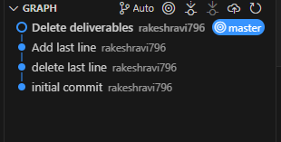

<h1>Assignment 1: Basic Git Workflow</h1> 

<h3>The git repository and it's commit history graph</h3>

<h3>Screenshot of the git log output</h3>

<h3> Explanation of the commits </h3>

<ul>
    <li>Initial Commit : Created a text file called sample.txt and contained the reqiremnts and deliverables for assignment 1</li>
    <li>delete last line : Deleted the last line in the text file</li>
    <li>Add last line : Added a last line for the text file</li>
    <li>Deleted deliverables : Deleted the deliverables part in the text file</li>
</ul>