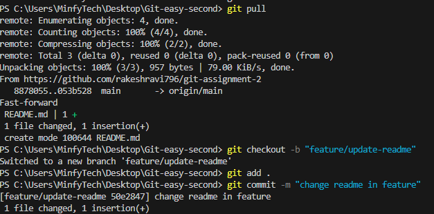
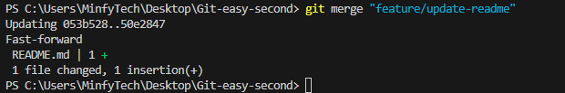

<h1>Assignment 2: GitHub Basics & Collaboration</h1>

<h3> Link to the Github repository</h3>

https://github.com/rakeshravi796/git-assignment-2

<h3>Screenshots for Pull and merge</h3>

<h4> Pull request </h4>

<h4>Merge Request</h4>

